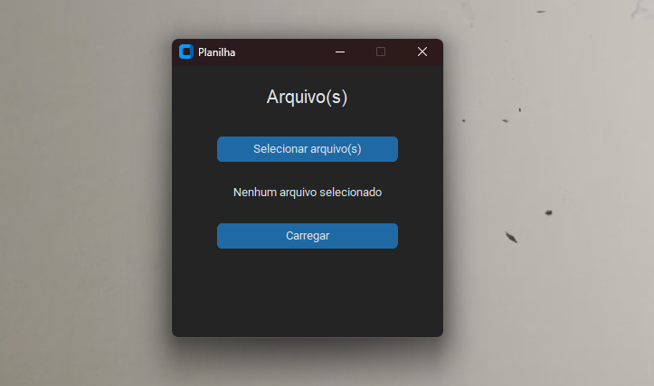

# 🧾 Formatador de Planilhas Excel (.xlsx)

Aplicativo de interface gráfica feito em **Python + CustomTkinter** que aplica **formatações e validações automáticas** em planilhas Excel `.xlsx`.

 <!-- Substitua por um print real se desejar -->

---

## 📦 Funcionalidades

- ✅ **Desbloqueia todas as células** inicialmente;
- 🔒 **Bloqueia automaticamente as colunas A até H**;
- 📋 **Validação na coluna I** com opções: `APTO` e `NÃO APTO`;
- ⚠️ **Validação condicional na coluna J**:
  - Se a célula da coluna I for `NÃO APTO`, a célula correspondente na coluna J **não pode ser preenchida**;
  - Mensagem de erro clara em caso de preenchimento incorreto;
- 🔐 **Protege a planilha com a senha** `senha1234`.

---

## 🖥️ Interface

1. Clique em **"Selecionar arquivo(s)"** para escolher as planilhas `.xlsx`;
2. Clique em **"Carregar"** para aplicar as formatações;
3. As planilhas serão atualizadas com segurança, e mensagens de sucesso/erro aparecerão.

---

## 📁 Estrutura Esperada da Planilha

A planilha precisa conter ao menos as colunas:
- **Coluna I**: `Posição (APTO/NÃO APTO)`
- **Coluna J**: `Valor Apto`

---

## ⚙️ Requisitos

- Python 3.7 ou superior
- Instale as dependências com:

```bash
pip install customtkinter openpyxl
